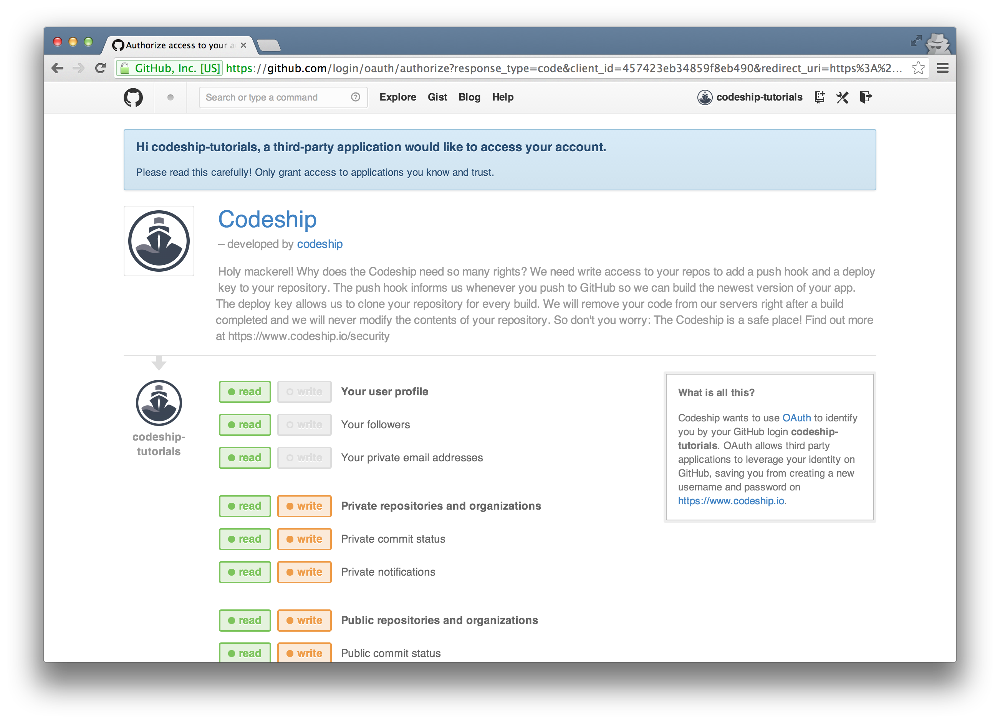
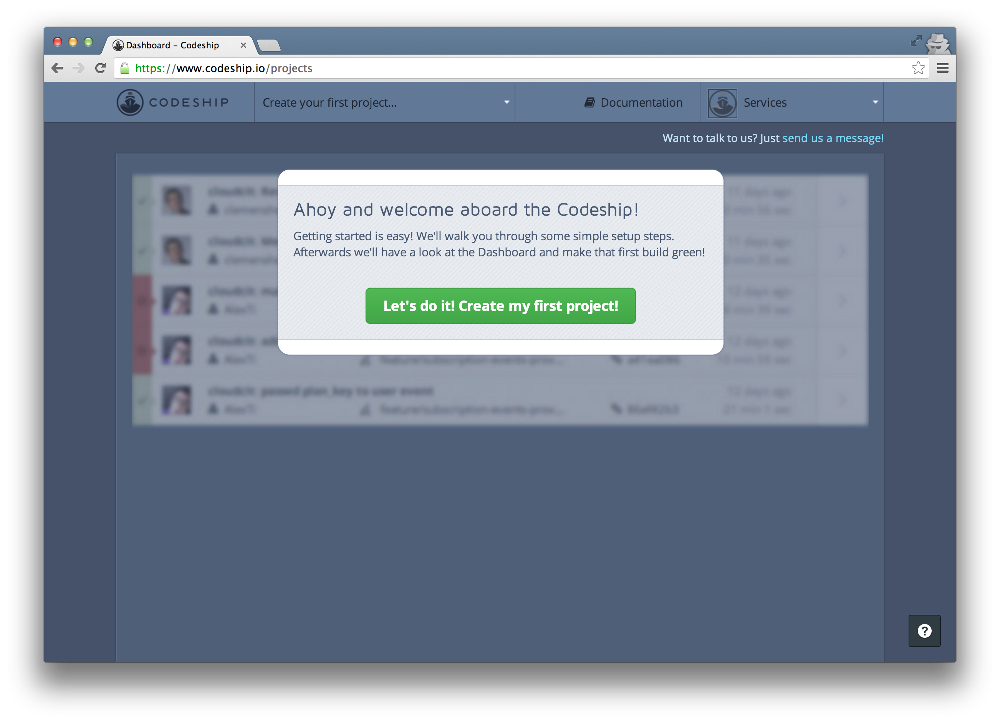
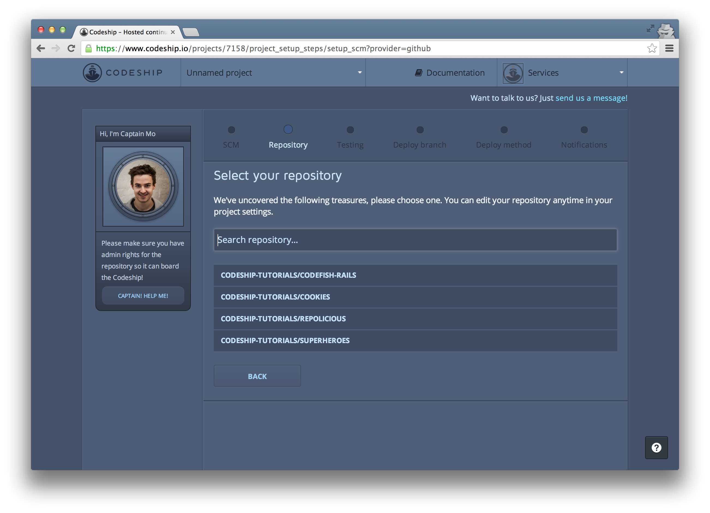
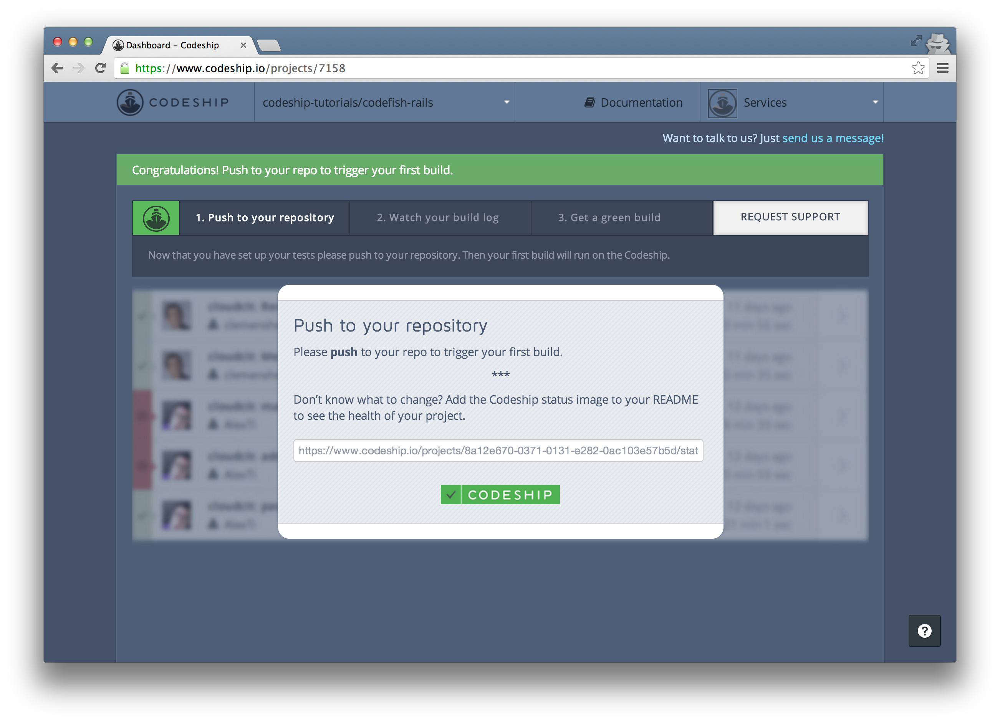
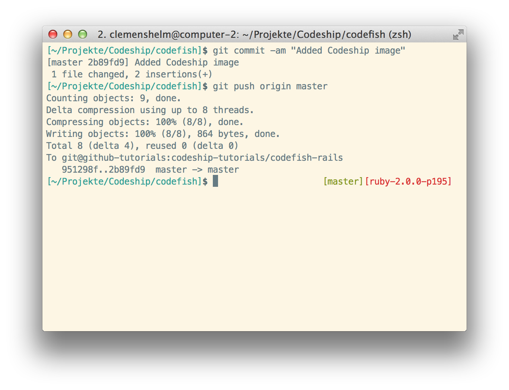
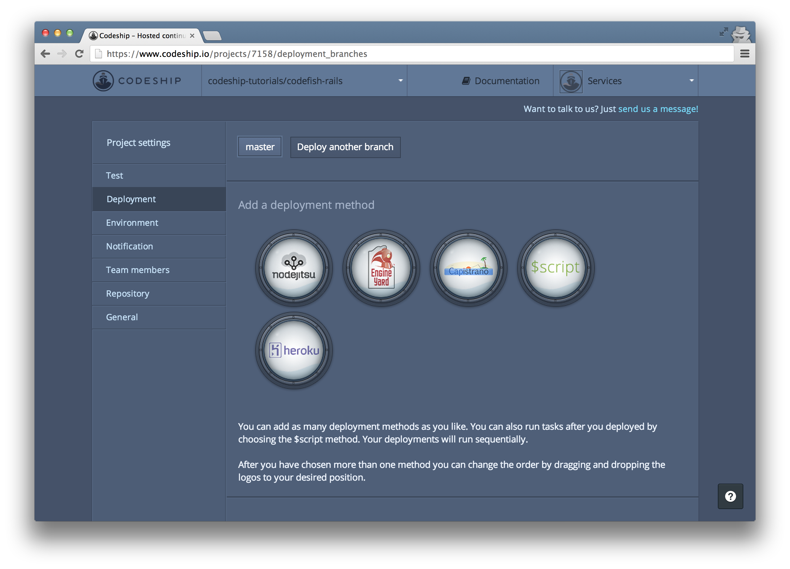
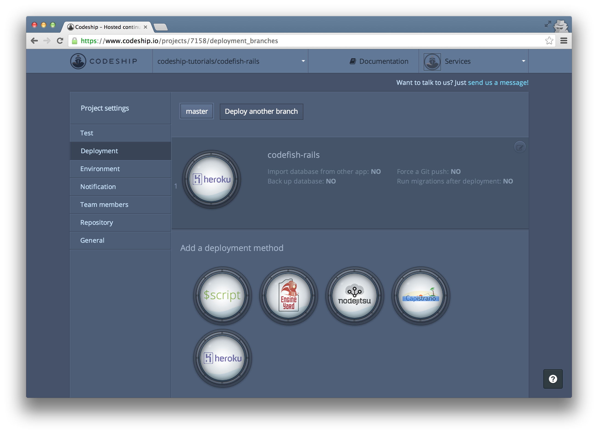
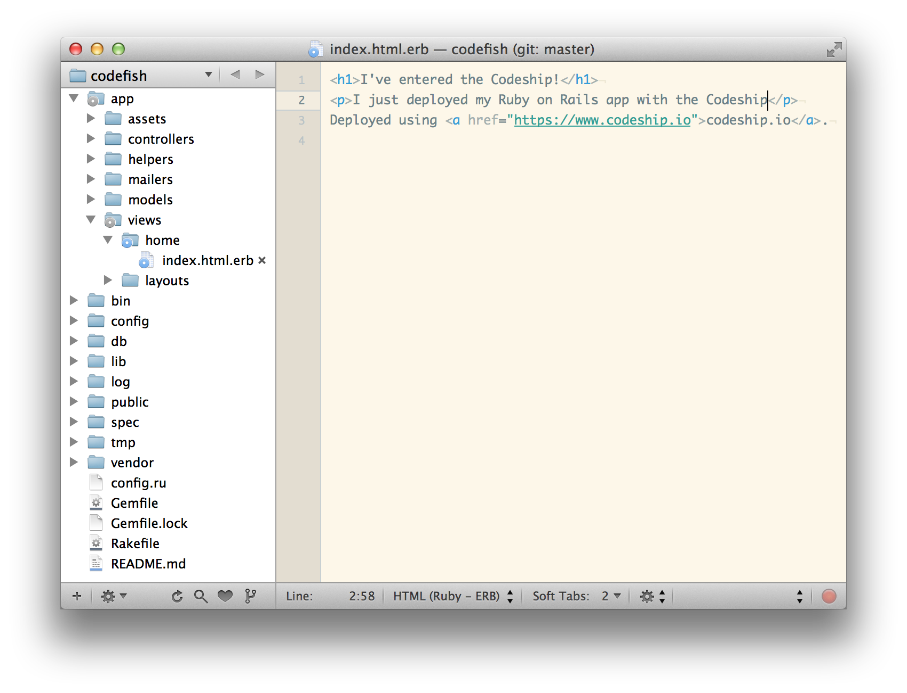
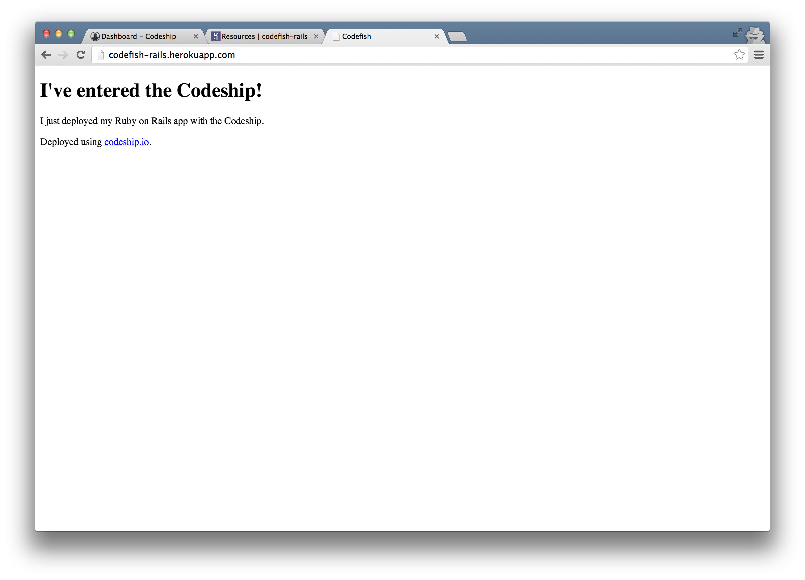

How to set up Continuous Integration and Continuous Deployment for a Ruby on Rails Application from GitHub to Heroku
======================

In this blog post we're gonna deploy a Ruby on Rails application from a GitHub repository to Heroku using [the Codeship](https://www.codeship.io/).

We've set up a simple Ruby on Rails application called [codefish](https://github.com/codeship-tutorials/codefish-rails) which contains some RSpec examples. We'll use screenshots of this application in this blog post. If you don't have an own project to set up but you want to follow along on your computer, just fork the repository.

Together, we're gonna deploy this application to Heroku using the Codeship.

First, sign in to the Codeship with GitHub. The Codeship needs access to your GitHub repositories to be able to set them up. Let's allow access.

We're back at the Codeship. Now let's create your first project.

The first step of your project setup is to select GitHub as your repository provider.

In the list of your GitHub repositories

search for the repository you want to set up and select it. In my case I search for "codefish".

Now your repository is connected and you can set up your test commands:

Codefish is a Ruby on Rails application. So I choose "Ruby on Rails" as my framework. This prepopulates the setup commands and the test commands for you.

The Codeship suggests Ruby 1.9.3, but you can use whatever Ruby version you like. If you're unsure about the Ruby version of your project, type `ruby -v` in the Terminal.

Just copy your Ruby version into the `rvm use` statement and add a hyphen before the patch version.

By deleting the hash key you can uncomment the test command `bundle exec rspec` to run your RSpec examples on every build.

Now let's finish your setup and go to the dashboard.

You can trigger a build for your application by pushing to your repository. Let's add the Codeship status image to the README file. I use markdown syntax to insert the image.

Now commit and push this change.

This triggered a new build on the Codeship.

You can access the build details by clicking the arrow on the right. Here you can follow the running build.

And a few seconds later your build succeeded! Great!

You see all the commands that were run. After a few initial preparation commands the Codeship ran the commands that you specified a few moments ago.

You can inspect the output of a single command by clicking on it. For the `codefish` application, we can see that two RSpec examples were run.

You've already pushed to your repository, watched your build log and got a green build. So you can finish the assistant at the top.

Now let's deploy your application to Heroku. Go to your project settings by clicking on the settings icon in the projects dropdown.

Then navigate to the "Deployment" section.

As we want to deploy to Heroku we click on the "Heroku" button.

Now you are asked to enter the name of your Heroku application and your API key. If you haven't already, now is the time to go to Heroku and create an application.

I named my application "codefish-rails", but please choose whatever name you like

and create your app.

Back at your deployment configuration on the Codeship enter the application name.

To retrieve your Heroku API key, follow the link to your Heroku account and click "Show API key".

Copy it and insert it into your deployment configuration at the Codeship.

Now save your deployment by clicking on the green checkmark on the right.

From now on the Codeship will deploy your application to Heroku everytime you push to your GitHub repository. Let's push a change and see if it gets deployed. Change something in your application first,

then commit and push the change.

And immediately another build will start running on the Codeship. Let's go back to your project overview.

After the commands we already know from your first build, your application also gets deployed to Heroku now.

And about 2 minutes later your application is online.

When you open the URL of your Heroku app now, your deployed application appears. You can find mine on [codefish-rails.herokuapp.com][http://codefish-rails.herokuapp.com].

If you need help with setting up your own application, please use the support link in the top-right corner or please tweet us [@codeship](http://www.twitter.com/codeship)!

