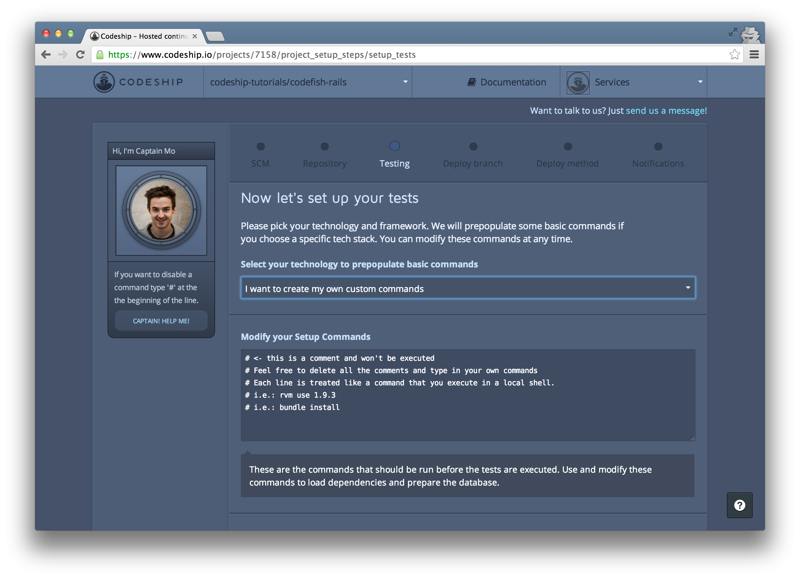
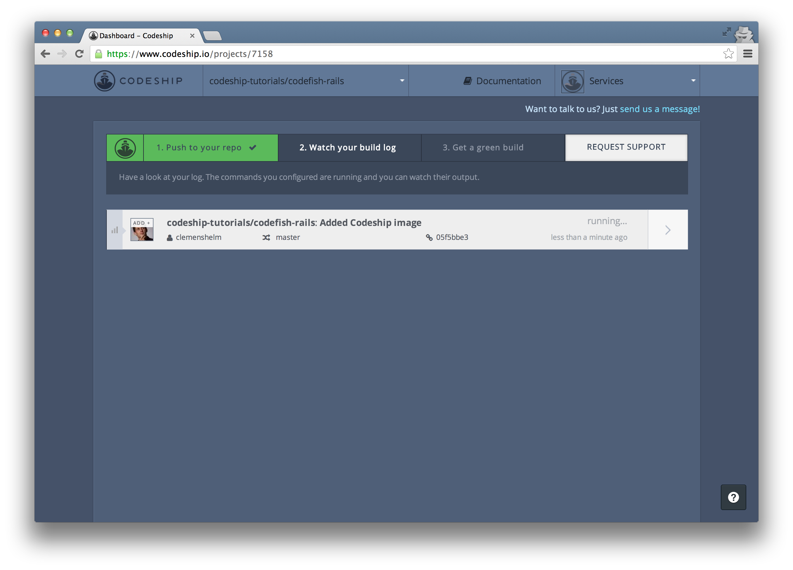
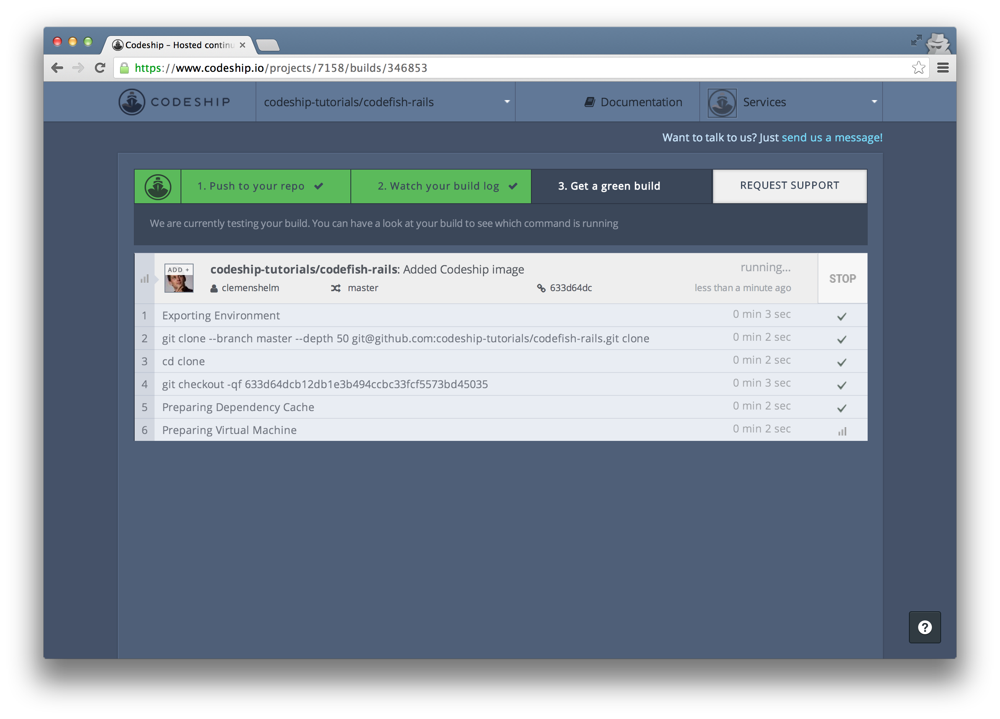
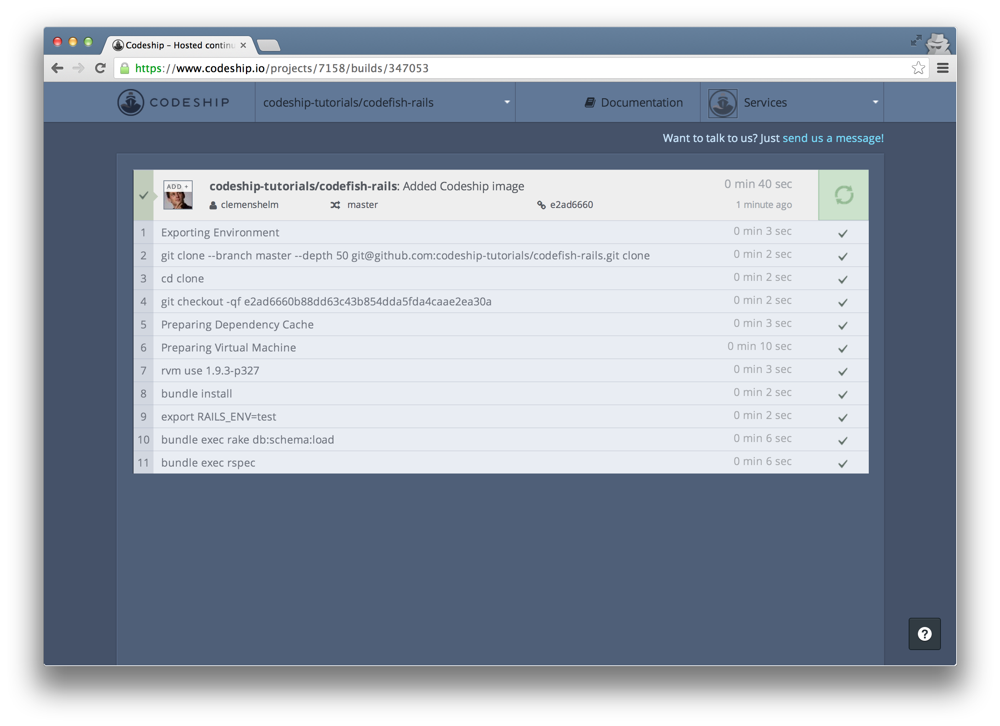

Deploying Rails from GitHub to Heroku
======================

In this screencast we're gonna deploy a Ruby on Rails application from a GitHub repository to Heroku using the Codeship.

I've got a simple Ruby on Rails application called [codefish](https://github.com/codeship-tutorials/codefish-rails) which contains some RSpec examples.

We're gonna deploy this application to Heroku using the Codeship.

Let's sign in with GitHub:

Codeship needs access to our GitHub repositories to be able to set them up. Let's allow access.

We're back at the Codeship. Now let's create our project.

We select GitHub as our repository provider.

In the list of my GitHub repositories

I search for my repo "codefish-rails" and select it.

Now we can set up our test commands:

We select "Ruby on Rails" as our framework. Now the setup commands and the test commands are already prefilled. Let's uncomment the test command `bundle exec rspec` to run our RSpec examples on every build.

Now let's finish our setup and go to the dashboard.

We can trigger a build for our application by pushing to our repository. Let's add the Codeship status image to the README file.

Now let's commit and push this change.

This triggered a new build on the Codeship.

When we go to the build details, we can follow the running build.

And a few seconds later, our build succeeded! Great!

Let's inspect our build and see what's happened.
[click on build name]
We see all the commands that were run. After a few preparation commands, the commands ran that we specified during the project setup.

We can inspect the output of a single command by clicking on it.
[click on RSpec command]
So we can see that two RSpec examples were run

[click on RSpec command again to close log]

We've already pushed to our repository, watched our build log and got a green build. So we can finish this assistent.

[click on road to success finish button]

Now let's deploy our application to Heroku. We go into our project settings

and then to the "Deployments" page.

