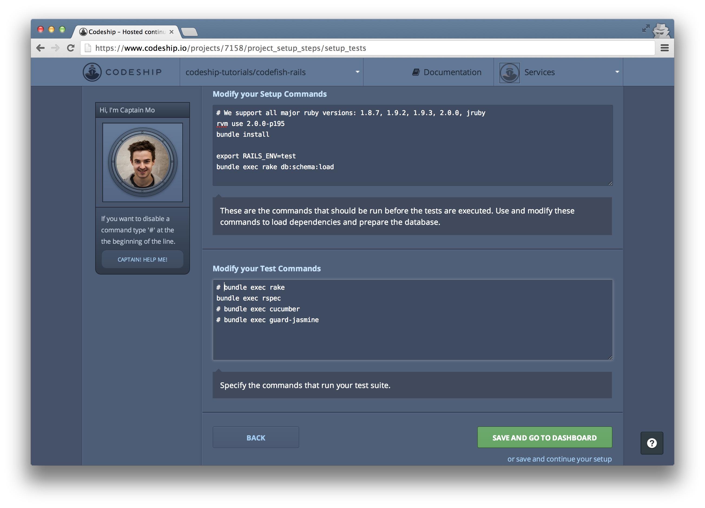
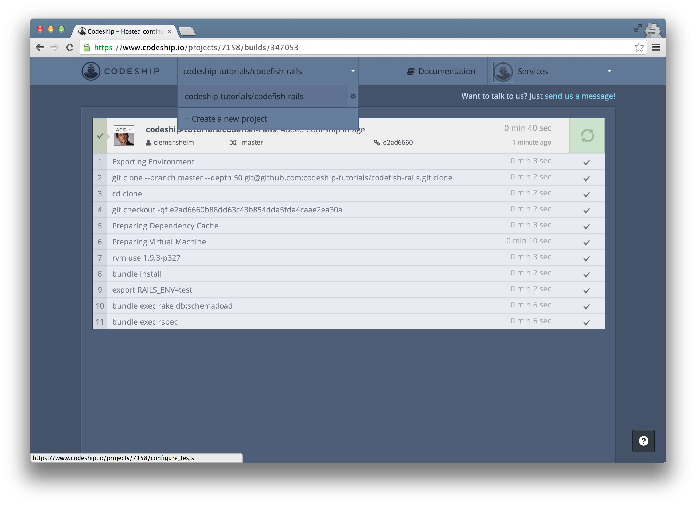
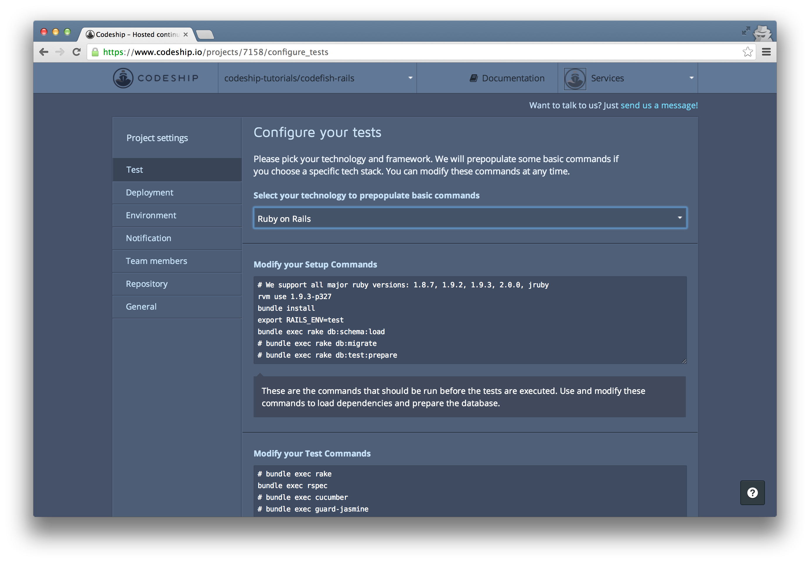
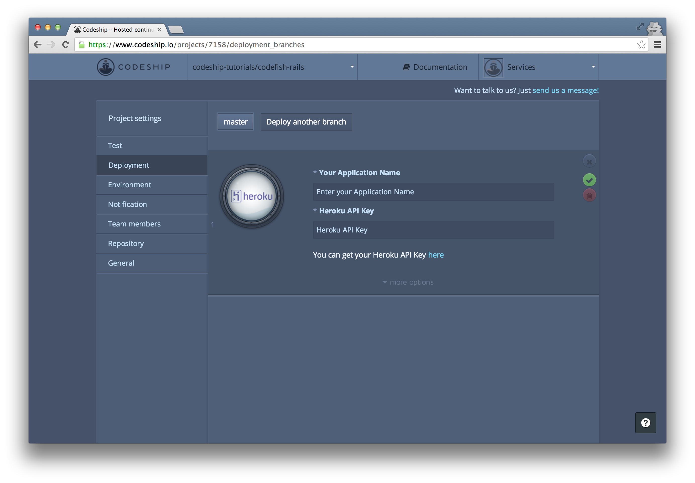
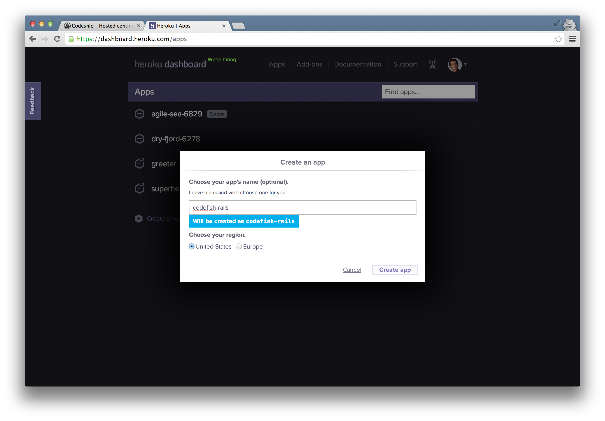
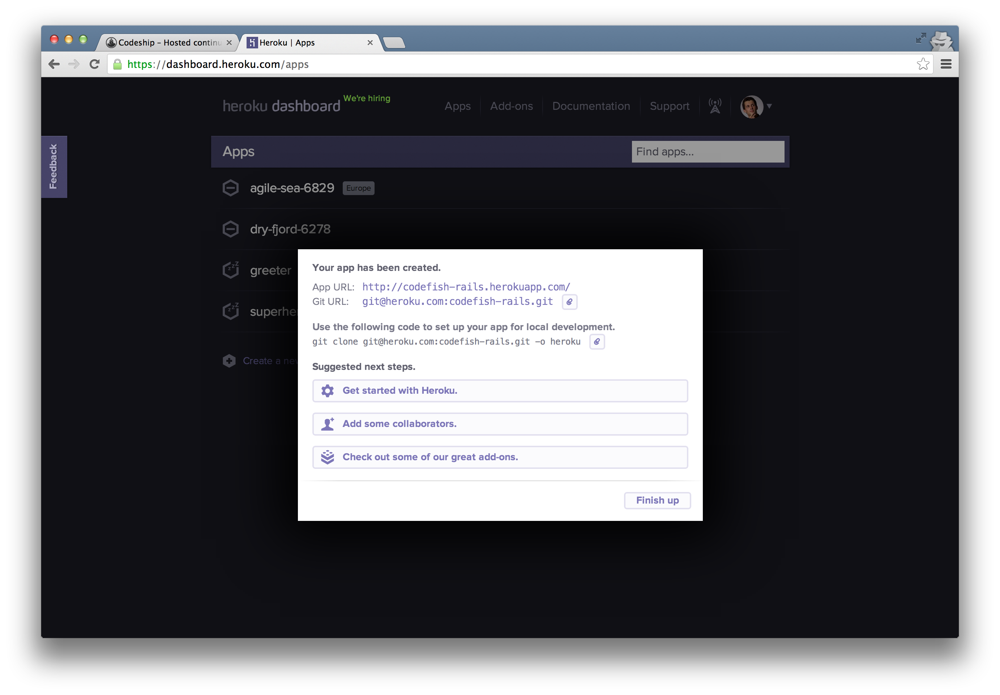
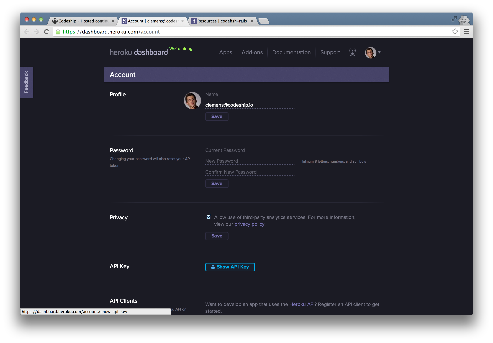
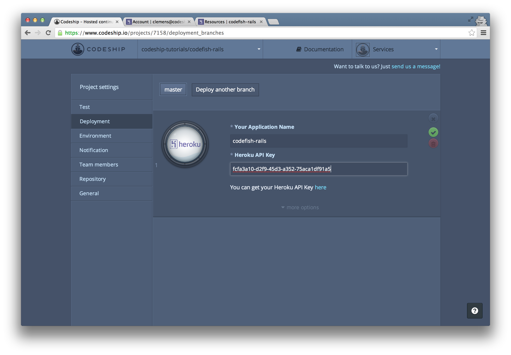
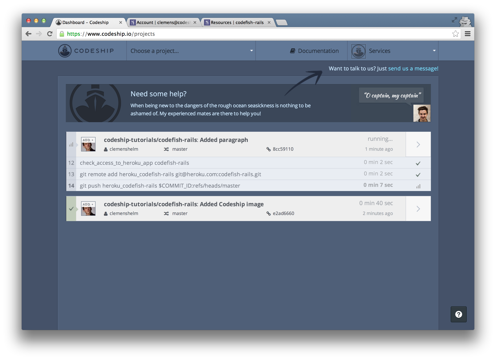

Deploying Rails from GitHub to Heroku
======================

In this screencast we're gonna deploy a Ruby on Rails application from a GitHub repository to Heroku using the Codeship.

I've got a simple Ruby on Rails application called [codefish](https://github.com/codeship-tutorials/codefish-rails) which contains some RSpec examples.

We're gonna deploy this application to Heroku using the Codeship.

Let's sign in to the Codeship with GitHub:

The Codeship needs access to our GitHub repositories to be able to set them up. Let's allow access.

We're back at the Codeship. Now let's create our first project.

I select GitHub as our repository provider.

In the list of my GitHub repositories

I search for my repo "codefish-rails" and select it.

Now our repository is connected and we can set up our test commands:

We select "Ruby on Rails" as our framework. This prepopulates the setup commands and the test commands for us.

On my computer I use Ruby 2.0.0 for our application. [enter `rvm list` in Terminal]

The Codeship suggests Ruby 1.9.3 by default, but we can use Ruby 2.0 by changing the `rvm use` command.

Let's uncomment the test command `bundle exec rspec` to run our RSpec examples on every build.

Now let's finish our setup and go to the dashboard.

We can trigger a build for our application by pushing to our repository. Let's add the Codeship status image to the README file.

Now let's commit and push this change.

This triggered a new build on the Codeship.

We can access the build details by clicking the arrow on the right. Here we can follow the running build.

And a few seconds later our build succeeded! Great!

We see all the commands that were run. After a few initial preparation commands the Codeship ran the commands that we specified a few moments ago.

We can inspect the output of a single command by clicking on it.
[click on RSpec command]
So we can see that two RSpec examples were run

[click on RSpec command again to close log]

We've already pushed to our repository, watched our build log and got a green build. So we can finish this assistent.

[click on road to success finish button]

Now let's deploy our application to Heroku. We go to our project settings

and then to the "Deployment" section.

We want to deploy to "Heroku".

Now we need to enter the name of our Heroku application and our API key. Let's go to Heroku and create an application.

I name my application "codefish-rails"

and create it.

Back at our deployment configuration I enter the application name "codefish-rails".

To retrieve my Heroku API key, I follow the link to my Heroku account and click "Show API key".

I copy it and insert it into my deployment configuration at the Codeship.

Now let's save our deployment configuration.

The Codeship will deploy our application to Heroku the next time we push to our GitHub repository. Let's add a paragraph "And I set it up in 2 minutes" to our template.

I commit and push the change

and immediately another build starts running on the Codeship.

After the commands that already ran in our first build, our application is deployed to Heroku

And about 2 minutes later our application is online.

When we open http://codefish-rails.herokuapp.com/ now, our deployed application appears.

If you need help with setting up your own application, please use the support link in the top-right corner or tweet us!

