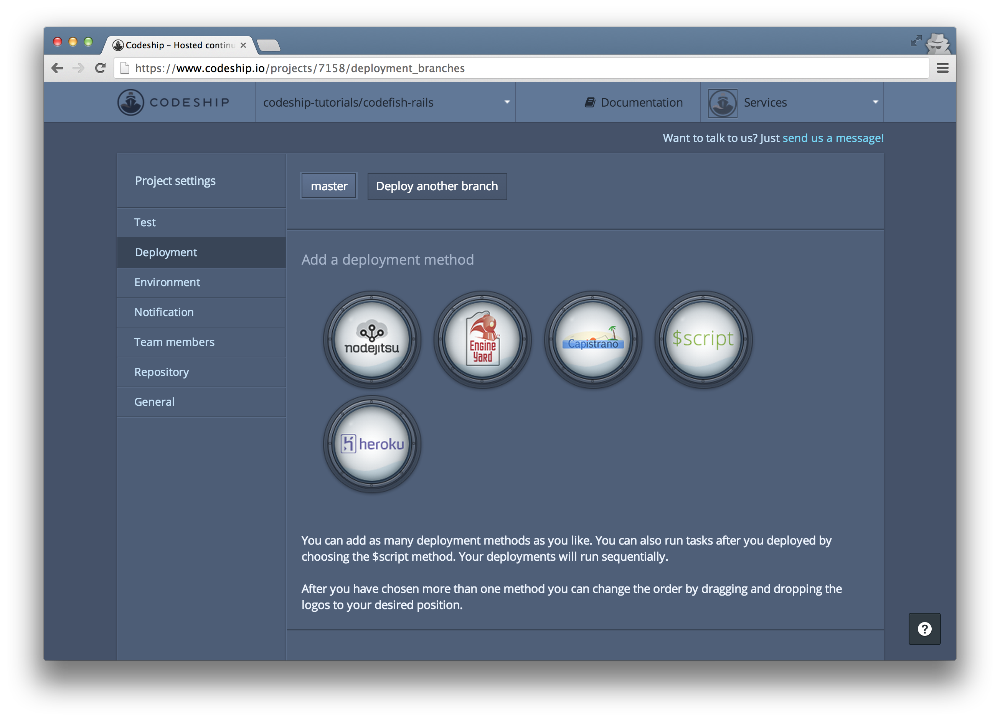
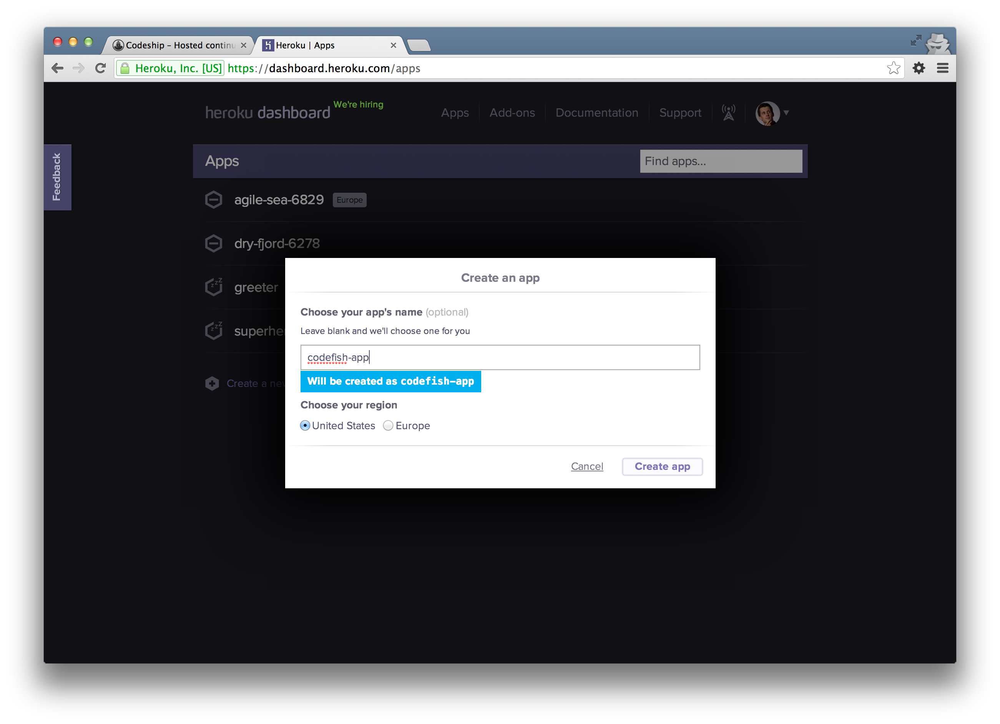
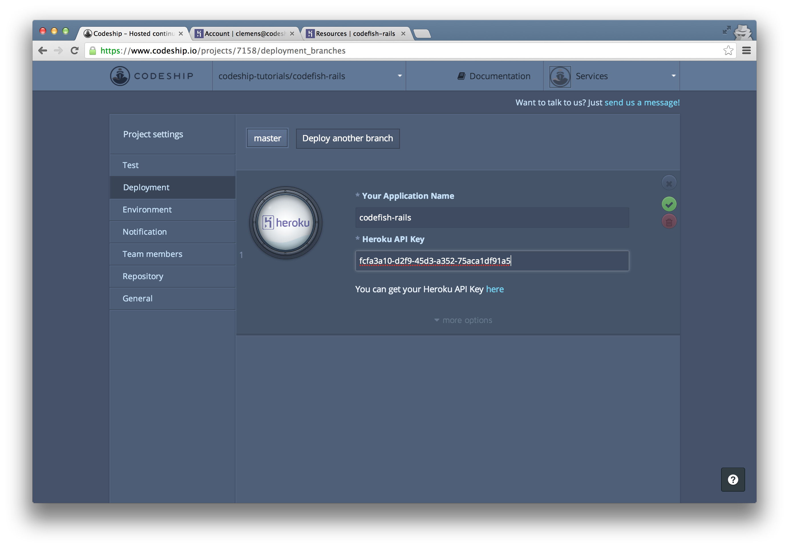
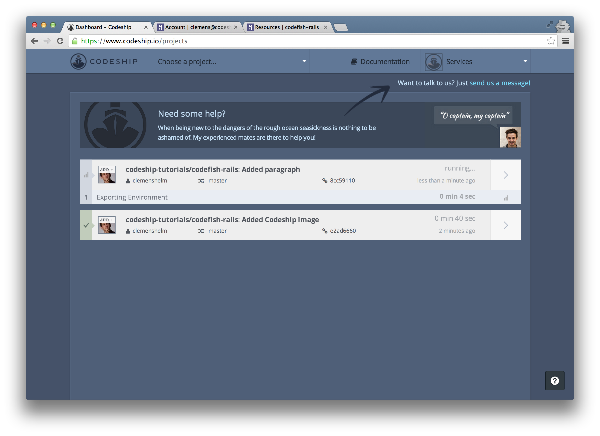

Deploying Ruby on Rails from Bitbucket to Heroku
======================

In this screencast we're gonna deploy a Ruby on Rails application from a Bitbucket repository to Heroku using the Codeship.

I've got a simple Ruby on Rails application called [codefish](https://bitbucket.org/codeship-tutorials/codefish-rails) which contains some RSpec examples. If you want to follow along these setup steps on your computer, just fork the repository. [move mouse pointer over "fork" button]

We're gonna deploy this application to Heroku using the Codeship.

Let's sign in to the Codeship with Bitbucket. The Codeship needs access to our Bitbucket repositories to be able to set them up. [scroll slowly] Let's allow access.

We're back at the Codeship. Now let's create our first project. [click create project button]

The first step of our project setup is to select Bitbucket as our repository provider.

In the list of my Bitbucket repositories

I search for my repo "codefish-rails" and select it.

Now our repository is connected and we can set up our test commands:

We select "Ruby on Rails" as our framework. This prepopulates the setup commands and the test commands for us.

The Codeship suggests Ruby 1.9.3, but I want to use the same Ruby version as on my computer. When I type `ruby -v` in the terminal, I find out that I use Ruby `2.0.0p195`.

So I just copy my Ruby version into the `rvm use` statement and add a hyphen before the patch version.

Let's uncomment the test command `bundle exec rspec` to run our RSpec examples on every build.

Now let's finish our setup and go to the dashboard.

To start our first build, we need to add a hook on Bitbucket. Let's copy the hook url and follow the link to the service hook settings of our repository. We add a "POST" hook,

paste the hook url

and save the hook.

[close Bitbucket tab]

We can trigger a build for our application by pushing to our repository. Let's add the Codeship status image [move mouse over green badge] to the README file.
[add markdown code for image to editor]

Now let's commit and push this change.

This triggered a new build on the Codeship.

We can access the build details by clicking the arrow on the right. Here we can follow the running build.

By the way, if you ever need help, check out the Codeship documentation. [move mouse over documentation link] If you encounter any problems, contact the Codeship crew by clicking on the support links in the top-right or the bottom-right corner. [move mouse over support links]

And a few seconds later our build succeeded! Great!

We see all the commands that were run. After a few initial preparation commands the Codeship ran the commands that we specified a few moments ago.

We can inspect the output of a single command by clicking on it.
[click on RSpec command]
So we can see that two RSpec examples were run

[click on RSpec command again to close log]

We've already pushed to our repository, watched our build log and got a green build. So we can finish this assistant.

[click on road to success finish button]

Now let's deploy our application to Heroku. We go to our project settings by clicking on the settings icon in the projects dropdown.

And then to the "Deployment" section.

We want to deploy to "Heroku".

Now we need to enter the name of our Heroku application and our API key. Let's go to Heroku and create an application.

I name my application "codefish-rails"

and create it.

Back at our deployment configuration I enter the application name "codefish-rails".

To retrieve my Heroku API key, I follow the link to my Heroku account and click "Show API key".

I copy it and insert it into my deployment configuration at the Codeship.

Now let's save our deployment configuration.

From now on the Codeship will deploy our application to Heroku everytime we push to our Bitbucket repository. Now let's push a change and see if it gets deployed. I add a paragraph "I just deployed my Ruby on Rails app with the Codeship." to the landing page.

I commit and push the change

and immediately another build starts running on the Codeship. Let's go back to our project overview. I will fast-forward until the build is finished.

After the commands we already know from our first build, our application also gets deployed to Heroku now.

And about 2 minutes later our application is online.

When we open http://codefish-rails.herokuapp.com/ now, our deployed application appears.

If you need help with setting up your own application, please use the support link in the top-right corner or tweet us at codeship!

